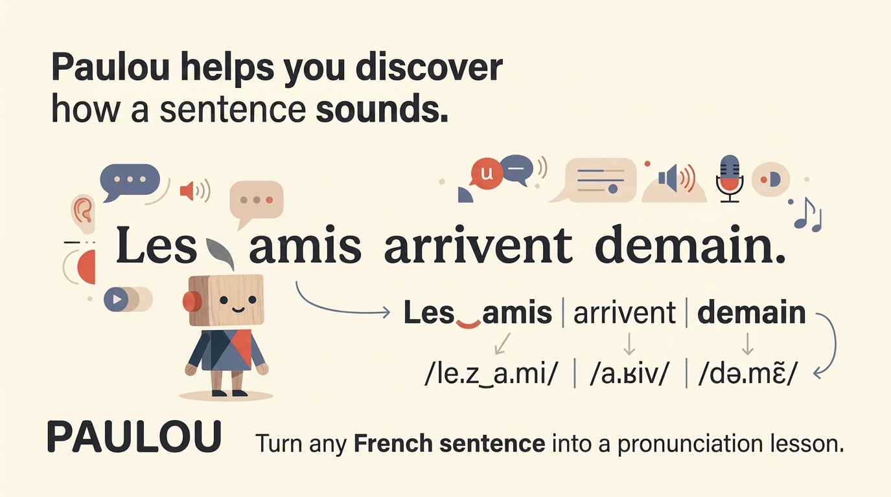

# Paulou



A French pronunciation practice app: users input any sentence they want to practice — not just pre-scripted content — and the app breaks it down into rhythmic chunks, then into word- and phoneme-level units, with liaison-aware guidance and speech assessment feedback at each level.

---

## Why Paulou

Most pronunciation apps (Duolingo, Babbel, ELSA Speak) only let users practice sentences the app already provides. Paulou lets users type in *their own* sentences — a presentation script, a real conversation they need to prepare for, a sentence they got wrong last week — and get the same level of structured practice as if it were curated content.

Two design bets follow from that:

- **Liaison as a first-class citizen.** French liaison (the way word-final consonants resurface before a following vowel, e.g. *les amis* → /le.z‿a.mi/) is one of the hardest things for learners to internalize, and most tools treat it as a footnote in feedback text rather than something structurally modeled and drilled. Paulou treats a liaison pair as its own unit of practice and scoring, distinct from single-word units.
- **Custom speech assessment instead of an off-the-shelf API.** Commercial pronunciation-scoring APIs (Azure Pronunciation Assessment was evaluated first) don't expose a way to control the phoneme sequence being scored against, and their French support lacks phoneme-level detail (no `NBestPhonemes`, no syllable breakdown for `fr-FR`). Liaison specifically is a known weak point even by Microsoft's own admission. Paulou instead builds a custom phoneme-level scoring pipeline — a single free-decode + 3-way alignment pass (Decision Log D36) — with full control over the reference phoneme sequence, so liaison can be scored deliberately rather than hoped for.

See [Key design decisions](#key-design-decisions) for the reasoning behind each major choice, with links to the experiments backing them.

---

## Architecture

```
User input (sentence)
        │
        ▼
[1] Sentence Parser        — splits into rhythmic chunks (groupe rythmique)
        │
        ▼
[2] Chunk Analyzer         — G2P, liaison rules, assembles PronunciationUnits
        │
        ▼
[3] TTS                    — one synthesis pass per sentence, sliced by timestamp
        │
        ▼
[4] Practice UI            — chunk-level and unit-level drilling
        │
        ▼
[5] Speech Assessment      — single free-decode + 3-way alignment pipeline
                              (Decision Log D36); pure functions and chunk-
                              level orchestration implemented and tested,
                              real free-phone recognizer model not yet built
```

| Stage | Folder | What it does |
|---|---|---|
| Sentence parsing | [`stages/parsing/`](stages/parsing/) | LLM-based chunking into rhythmic groups (Gemini API, Decision Log D27) |
| G2P | [`stages/chunk_analyzer/g2p/`](stages/chunk_analyzer/g2p/) | Word → phonemes (Lexique400 + eSpeak-ng fallback, Decision Log D30) |
| POS tagging | [`stages/chunk_analyzer/pos/`](stages/chunk_analyzer/pos/) | Needed to apply liaison rules correctly |
| Liaison rules | [`stages/chunk_analyzer/liaison/`](stages/chunk_analyzer/liaison/) | Obligatoire / interdite / facultative rule engine |
| Elision detection | [`stages/chunk_analyzer/elision/`](stages/chunk_analyzer/elision/) | Closed-list lookup for elided clitics (l', d', j', ...) — distinct from liaison, Decision Log D28 |
| Unit assembly | [`stages/chunk_analyzer/assembly/`](stages/chunk_analyzer/assembly/) | Groups words into `single`, `liaison_group`, or `elision_group` `PronunciationUnit`s |
| TTS | [`stages/tts/`](stages/tts/) | Sentence-level synthesis with word-boundary timestamps — two swappable providers (Azure Neural, edge-tts, Decision Log D31), plus caching (D7) and chunk/unit audio slicing (D5) |
| Speech Assessment | [`stages/speech_assessment/`](stages/speech_assessment/) | Single free-decode + 3-way alignment pipeline (Decision Log D36), replacing the earlier two-branch GOP/free-decode split. Pure functions implemented and tested: `align.py` (3-way Levenshtein, D38), `scoring.py` (per-op-type accuracy score, D39), `merge.py` (MEAN aggregation, D40), `feedback.py` (structural-error + bracket phrasing, D41), `calibration.py` (kept, renamed from GOP-specific naming, D39). Chunk-level orchestration also implemented: `speech_assessment.py::score_chunk` (D42), tested via a stub `FreePhoneRecognizer`. Not yet built: a real `FreePhoneRecognizer` model and the diagnostic bias check (both MVP-blocking) — see Current status. |

Every model-backed or externally-dependent stage (parser, G2P source, TTS provider, free-phone recognizer) is defined as a `Protocol` interface and resolved through a small registry, so alternative implementations can be swapped via config without touching the pipeline or other stages — this is what lets `stages/tts/azure_tts.py` and `edge_tts_provider.py` coexist today (Decision Log D31). The GOP-scorer swappability example (`kaldi_gop.py`/`gopft_gop.py`) no longer applies — see Decision Log D36; the swappable interface for Speech Assessment going forward is `FreePhoneRecognizer` alone — its signature was simplified per Decision Log D37 to `decode(audio) -> tuple[list[str], list[float], list[tuple[int, int]]]` (phones, per-position confidence, per-position time boundaries), dropping the originally-specced full posterior vector once nothing downstream needed more than one float per position. Pure, deterministic logic (liaison rules, unit assembly, alignment, merging, calibration, feedback templates) is kept as plain functions — no abstraction layer, since there's no real expectation of swapping these.

The core pipeline (`core/`, `stages/`, `pipeline.py`) is plain Python with no dependency on any UI layer. It's callable directly from a notebook or test, and a thin `backend/api/` (FastAPI) wraps it for the eventual frontend — the pipeline itself has no knowledge that a backend or frontend exists.

---

## Key design decisions

| Decision | Why | Backing |
|---|---|---|
| Custom phoneme-level pipeline instead of Azure Pronunciation Assessment | Azure gives no control over the reference phoneme sequence and lacks phoneme-level detail for `fr-FR`; liaison handling is unverifiable | — |
| ~~Two parallel branches (GOP forced-align + free phone recognition)~~ — **superseded, Decision Log D36** | Reversed in favor of a single free-decode + 3-way Levenshtein alignment pipeline (substitution + insertion + deletion in one pass) — faster to build and control for MVP, and matches the pattern used by other current open-source pronunciation tools (OpenPronounce, Echoic) | — |
| Liaison modeled as its own `PronunciationUnit` type, not a word-level footnote | Liaison is a resyllabification phenomenon — scoring and drilling it as two separate words loses the thing being taught | — |
| Unsupervised percentile/z-score calibration, not a supervised regressor | No labeled French pronunciation dataset exists (unlike English's speechocean762); building one is deferred until there's real usage data to justify it | — |
| Sentence-level TTS synthesis (not per-chunk or per-unit) | Preserves natural prosody and in-context liaison; chunks/units are sliced from one audio pass via timestamps, not synthesized separately | — |
| Rule-based liaison detection (not a learned model) | Sufficient because MVP content is either app-authored or short user sentences; a purely rule-based approach is known to break down on unconstrained free-form input (this is a known, accepted limitation — see below) | — |

---

## Current status

**Build order steps 1–3 (Roadmap) are fully implemented and tested. Step 4 (Speech Assessment) is done except for the real model** — every pure function and the chunk-level orchestration that wires them together (Decision Log D36–D42) is implemented and tested; only a real `FreePhoneRecognizer` and the diagnostic bias check that must validate it (Decision Log D10) remain.

**Implemented so far:**
- **Pure functions** (step 1): liaison rule engine (`stages/chunk_analyzer/liaison/rule_engine.py`), elision detection (`stages/chunk_analyzer/elision/elision.py`, Decision Log D28), unit assembly (`stages/chunk_analyzer/assembly/unit_assembler.py`), calibration (`stages/speech_assessment/calibration.py`), feedback templating (`stages/speech_assessment/feedback.py` — redesigned in D32 to apply uniformly to every unit type, not just `single` as D19 originally scoped it).
- **G2P + POS tagging** (step 2): `stages/chunk_analyzer/g2p/lexique_espeak.py` (Lexique400 lookup, Decision Log D30, + eSpeak-ng fallback) and `stages/chunk_analyzer/pos/spacy_tagger.py` (spaCy `fr_core_news_sm`).
- **Sentence parser + TTS** (step 3): `stages/parsing/gemini_parser.py` (Gemini API, Decision Log D27); TTS has TWO swappable providers — `stages/tts/azure_tts.py` (official Azure SDK) and `stages/tts/edge_tts_provider.py` (unofficial, no API key needed, Decision Log D31) — plus `stages/tts/caching.py` (hash-based cache, D7) and `stages/tts/audio_slicing.py` (chunk/unit clip extraction with silence padding + fade, D5).
> **Superseded by Decision Log D36** — the item below describes work built
> against the abandoned two-branch (GOP + free-decode) design. It is kept
> here as an accurate historical record of what was built and tested, not
> as current architecture. None of it is confirmed to carry forward
> unchanged into the single-pipeline redesign.
- **Speech Assessment orchestration/plumbing** (step 4, "Stage A" — real GOP model is "Stage B", not started): `stages/speech_assessment/calibration.py` and `feedback.py` (feedback redesigned in Decision Log D32 — groups phones by score bracket instead of naming only the weakest, and now applies uniformly to every unit type, not just `single`), `phoneme_grouping.py` (5a-2, D20), `merge.py` (5e, MEAN aggregation, D33), and `speech_assessment.py` (orchestrates GOP → calibration → grouping → merge into a `UnitResult` per unit, D34/D35). `PronunciationUnit` gained a `phonemes: list[str]` field to support this (not in the Architecture Spec's original schema). Optional-silence (`SIL`) handling between units is implemented but its correctness depends on a real GOPScorer's alignment behavior — unverified (D35). Tested throughout with a simulated stub GOPScorer, not a real acoustic model.
- **Speech Assessment, redesigned pipeline** (Decision Log D36–D42) — the item above describes work built against the abandoned two-branch design, kept as an accurate historical record, not current architecture. The actual current pipeline: `core/models.py` gained `AlignmentOp` and `ScoredAlignmentOp`, replacing `RawPhoneScore`/`PhoneScore` (dormant, not deleted — D37); `stages/speech_assessment/align.py::align_phonemes` (3-way Levenshtein — substitution/insertion/deletion in one pass, D38); `scoring.py::score_alignment_op` (per-op-type accuracy scoring, D39); `calibration.py` kept and reused, `raw_gop` renamed to `raw_value` since GOP no longer exists (D39); `merge.py::merge_to_unit_result` and `merge_chunk_results` (MEAN aggregation carried over from the old design, plus grouping a chunk's ops by unit, D40); `feedback.py::generate_feedback` (structural-error sentences plus D32's bracket phrasing for matches, D41); and `speech_assessment.py::score_chunk` (chunk-level orchestration wiring a `FreePhoneRecognizer` through the above, tested via a stub — no real model needed, D42). `core/interfaces.py::FreePhoneRecognizer` is the real (simplified, D37) Protocol; `GOPScorer` is now explicitly dormant there.
- Core data models added incrementally as each stage needs them (`core/models.py`): `LiaisonDecision`, `PronunciationUnit`, `AlignmentOp`, `ScoredAlignmentOp`, `UnitResult`, `WordTiming` (`RawPhoneScore`/`PhoneScore` kept dormant, not deleted). `Sentence`, `Chunk`, `Attempt` not needed yet.
- 146 tests passing (125 fast unit tests, 12 model tests requiring the real spaCy model, 9 contract tests requiring real Gemini/Azure credentials) — see `tests/README.md`. (A 10th contract test file, for edge-tts, needs no credential but isn't included in this count — see that file's own notes on why it's run separately.)

**Known data/tooling gaps, not yet resolved:**
- The real Lexique400 database (Decision Log D30 — not Lexique383 as originally named) is wired in via `LexiqueEspeakG2P.from_lexique400()`, but nothing in the codebase calls it by default yet — `pipeline.py` doesn't exist yet to wire it in as the production default, so the plain constructor still loads the small hand-written test fixture. The 33MB file itself isn't committed to the repo (git-ignored), so it must be downloaded separately — see SETUP.md.
- The native-French-corpus calibration statistics (Decision Log D11) haven't been produced yet — `calibrate_score` takes the stats table as a parameter rather than embedding real numbers. Originally scoped for GOP values, now feeds `match`-op confidence calibration instead (Decision Log D39); the math is unchanged.
- No `PipelineConfig` exists yet to choose a default TTS provider (Azure vs edge-tts) — both are registered and usable, but nothing picks one automatically.
- No real `FreePhoneRecognizer` implementation exists yet — `stages/speech_assessment/speech_assessment.py::score_chunk`'s orchestration is fully built and tested (Decision Log D42), but only against a stub. The canonicalizer bias diagnostic (Decision Log D10) needed to trust a real model's output before scoring anything for real hasn't been run yet — see MVP-blocking below.

**Next up:** Stage B — a real `FreePhoneRecognizer` implementation, and the diagnostic bias check (Decision Log D10) needed to trust its output before scoring anything for real. Everything else in the pipeline is built and tested. See Roadmap.

**MVP-blocking (moved up from post-MVP per Decision Log D36):**
- **Canonicalizer bias in the free phone recognizer.** Since D36 makes one free-decode model responsible for scoring ALL error types (not just insertion/deletion as originally scoped), this diagnostic can no longer be deferred past MVP. A small diagnostic set (native / substitution / deletion / insertion recordings) needs to be run through the model before its output can be trusted for scoring.

**Known limitations (by design, not oversight):**
- Liaison detection is rule-based (`stages/chunk_analyzer/liaison/rule_engine.py`), which is expected to be incomplete on unconstrained free-form input containing rare vocabulary, proper nouns, or borrowed words. This is an accepted MVP tradeoff (Decision Log D4), deferred post-MVP.
- **Confirmed, not just theoretical:** the POS tagger (spaCy `fr_core_news_sm`) mistags "content" (adjective, "happy") as `ADV` even in a full, grammatically correct sentence, which causes the liaison rule engine's "très/trop + ADJ" obligatoire pattern to miss real liaison for this specific word. Locked in as a known limitation for now — see the decision log's POS tagging entry.
- French support in the underlying acoustic models and tooling generally lags English; the current `FreePhoneRecognizer` candidate (`Cnam-LMSSC/wav2vec2-french-phonemizer`) is community-maintained rather than officially supported at the scale of its English equivalents.

---

## Getting started

*Steps below reflect what's actually built and tested right now (build order steps 1–3 — see [Current status](#current-status)). Everything under "not yet built" is aspirational, kept here as a placeholder for later stages — see the [Roadmap](docs/roadmap.md) for the build order.*

```bash
# clone and install
git clone https://github.com/quynhkhanh96/paulou.git
cd paulou                                    # repo root (docs/, this README, SETUP.md, the paulou/ package)
pip install -r requirements-dev.txt
python -m spacy download fr_core_news_sm     # separate step — see SETUP.md if this fails
cp .env.example .env                         # then fill in GEMINI_API_KEY / Azure Speech key — see SETUP.md

# move into the package to run tests (no packaging / pip install -e . set up yet)
cd paulou

# fast suite — pure functions + G2P dict lookup, no models needed
pytest tests/unit -v

# model-backed suite — loads the real spaCy model, slower
pytest tests/model -v -m model

# contract suite — calls the real Gemini + Azure APIs, needs credentials
pytest tests/contract -v --ignore=tests/contract/test_edge_tts_provider_contract.py

# edge-tts contract — no credential needed, but run separately (see tests/README.md — can hang on restrictive networks)
pytest tests/contract/test_edge_tts_provider_contract.py -v
```

**Not yet built** (kept as a placeholder for later build-order steps):

```bash
# run an experiment (compares candidate implementations for a stage,
# e.g. free-phone-recognizer candidates once there's more than one)
python experiments/runners/compare_free_phone_recognizers.py
```

Qualitative review notebooks (chunking quality, audio playback, alignment
visualization, canonicalizer bias diagnostics) live in `experiments/notebooks/`.

---

## Repo structure

```
Paulou/                                # repo root
├── docs/
│   └── assets/
├── README.md                          # this file
├── SETUP.md                           # local dev setup (venv, dependencies, running tests)
├── requirements-dev.txt
├── .env.example                       # GEMINI_API_KEY, AZURE_SPEECH_KEY/REGION — copy to .env at this same level
├── .gitignore
└── paulou/                            # the actual Python package
    ├── core/                          # data models, interfaces (Protocol), registry — built incrementally as stages need them
    ├── stages/                        # one subfolder per pipeline stage, swappable implementations
    │   ├── parsing/                   # implemented — Gemini API sentence parser (Decision Log D27)
    │   ├── chunk_analyzer/            # stage 2's sub-modules, nested here (Decision Log D29)
    │   │   ├── liaison/               # implemented — rule engine
    │   │   ├── elision/               # implemented — closed-list clitic detection (Decision Log D28)
    │   │   ├── assembly/              # implemented — unit assembly
    │   │   ├── g2p/                   # implemented — Lexique400 lookup (D30) + eSpeak-ng fallback; test fixture used by default, real DB via from_lexique400() (not committed, .gitignore)
    │   │   └── pos/                   # implemented — spaCy fr_core_news_sm
    │   ├── speech_assessment/         # pure functions implemented (D36-D41): align.py, scoring.py,
    │   │                              #   merge.py, feedback.py, calibration.py; orchestration
    │   │                              #   implemented (D42): speech_assessment.py::score_chunk;
    │   │                              #   free_decode/ (real FreePhoneRecognizer, Stage B) not yet built
    │   └── tts/                       # implemented — Azure Neural + edge-tts providers, caching, audio slicing (D5/D7/D31)
    ├── pipeline.py                    # not yet built — PaulouPipeline orchestration entry point
    ├── backend/                       # not yet built — FastAPI app, DB models/repository, background jobs
    ├── frontend/                      # not yet built — client app (TBD)
    ├── tests/
    │   ├── unit/                      # implemented — fast, pure functions + G2P dict lookup
    │   ├── model/                     # implemented — slow, loads the real spaCy model
    │   ├── contract/                  # implemented — calls the real Gemini API, needs GEMINI_API_KEY
    │   ├── fixtures/                  # implemented — g2p_golden.tsv (fixture lexicon)
    │   ├── api/                       # not yet built (no backend yet)
    │   └── db/                        # not yet built (no backend yet)
    └── experiments/                   # not yet built — implementation comparisons, diagnostic sets, review notebooks
```

---

## Contributing

This is primarily a personal research and learning project, built alongside a PhD. Issues and PRs are welcome, but response times may be slow, especially through end of 2026.

---

## License

[Functional Source License (FSL)](https://fsl.software/) — converts automatically to Apache License 2.0 two years after each version's release. Source is public and free to read, use, and modify for non-competing purposes; see [LICENSE](LICENSE) for full terms.

---

## Acknowledgments & references

- [Lexique400](http://www.lexique.org/) — open French phonetic/lexical database (Decision Log D30 — supersedes the originally-planned Lexique383)
- [eSpeak NG](https://github.com/espeak-ng/espeak-ng) — fallback grapheme-to-phoneme synthesis
- [Azure Neural TTS](https://azure.microsoft.com/en-us/products/ai-services/text-to-speech) — official TTS provider (Decision Log D5/D6/D7)
- [edge-tts](https://github.com/rany2/edge-tts) — unofficial, no-API-key TTS provider added alongside Azure (Decision Log D31)
- [Cnam-LMSSC/wav2vec2-french-phonemizer](https://huggingface.co/Cnam-LMSSC/wav2vec2-french-phonemizer) — candidate `FreePhoneRecognizer` model, free French phoneme recognition (not yet wired in — Stage B)
- [OpenPronounce](https://github.com/Halleck45/OpenPronounce) and [Echoic](https://github.com/xialeistudio/echoic) — open-source pronunciation-assessment tools whose free-decode + alignment approach informed Decision Log D36's redesign